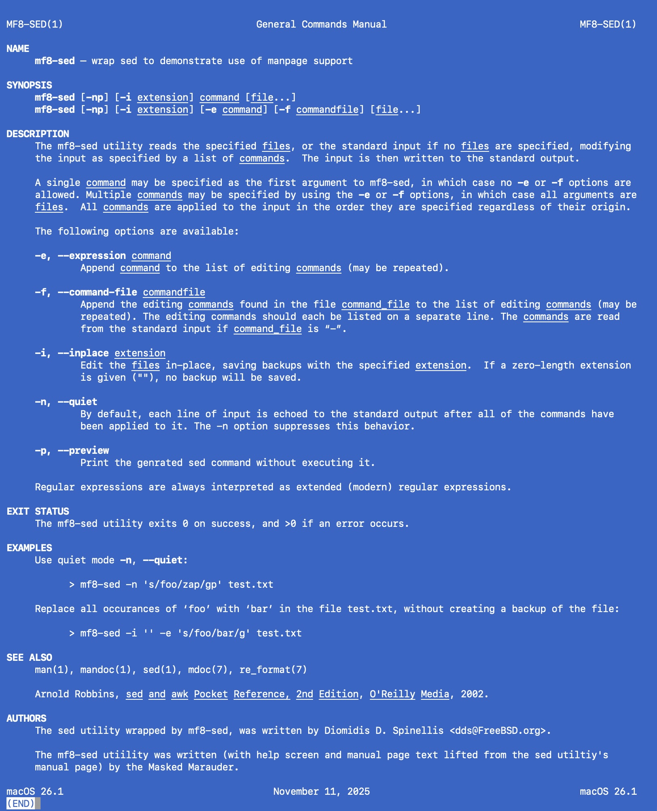

## Command Argument Library

A Swift library with a succinct syntax for defining and parsing command line arguments.

---

### Highlights

* The library provides macros that generate peer functions that parse command-line arguments and pass the
parsed values to annotated "work functions".

* The syntax of acceptable command-line arguments and the types of the parsed values are determined solely from 
the work function’s parameters (except for one macro option, `shadowGroups`).

* The library’s deterministic nature imposes some common-sense limitations on work function parameters. If you
are using Xcode, violations will be flagged as errors as you edit your code.

* "Meta-services", like help screens, manual pages, and shell completion scripts, are defined by parameters with 
type `MetaFlag`. There are no reserved names (like "help" or "version"), and there is no limit on the number of 
meta-flag parameters that can be declared in a work function.

* Help screens and manual pages are are “laid out” with arrays of "show elements" that generate parameter 
descriptions, usage lines (default or customized) and text blocks. Say goodbye to the hackneyed 
“ARGUMENTS, OPTIONS, FLAGS” layout.

* The library supports hierarchical command structures, including “stateful” structures where parent commands can
receive, modify and pass state to subcommands.

* The library’s parser collects and reports multiple errors in a single pass.

* There are no plug-ins.

---

### Usage

Begin by writing a work function that performs all or part of your program's logic. Annotate the work function
with one of three macros provided the library. The macro generates peer a function that parses command line
arguments, and calls the work function with the parsed values.

---

### Simple Command Line Utility

You can generate a fully functional command line utility, with meaningful error reporting, just by annotating a
work function with the `MainFunction` macro.

<details>
<summary>Code</summary>

```swift
import CmdArgLib
import CmdArgLibMacros

/// Print a phrase count times, optionally uppercased or with an index.
@MainFunction
private func mf0Print(
    i showIndex: Flag,
    u upper: Flag,
    count: Int = 1,
    _ phrase: String
{
    for index in 0..<max(count, 1) {
        var line = showIndex ? "  \(index + 1). \(phrase)" : "  \(phrase)"
        if upper { line = line.uppercased() }
        print(line)
    }
}

main()
```

</details>

<details>
<summary>Command Calls</summary>

```
> ./mf0-print "Simplicity is complexity resolved."
  Simplicity is complexity resolved.
```

```
> ./mf0-print -ui --count=2 "Simplicity is complexity resolved."
  1. SIMPLICITY IS COMPLEXITY RESOLVED.
  2. SIMPLICITY IS COMPLEXITY RESOLVED.
```

```
>> ./mf0-print -uxlc --lower --count 3.2
Errors:
  unrecognized options: '-x', '-l' and '-c', in '-uxlc'
  unrecognized option: '--lower'
  missing a '<string>'
  '3.2' is not a valid <int>
See 'mf0-print --help' for more information.
```

There is no reference like "see mf0-print --help ..." in the error screen because "--help" has not been defined.

```
> ./mf0-print --help
Errors:
  unrecognized option: '--help'
  missing a '<string>'
```

</details>

---

### Simple Command Line Utility With A Help Screen

This is the same as the previous example, except that the work function has meta-flag parameter
the defines a help screen using an array of "show elements"."

<details>
<summary>Code</summary>

```swift
import CmdArgLib
import CmdArgLibMacros

/// Define the help screen elements 
private let showElements: [ShowElement] = [
    .text("DESCRIPTION:", "Print a greeting."),
    .synopsis("\nUSAGE:"),
    .text("\nPARAMETERS:"),
    .parameter("showIndex","Show the index of each repetition"),
    .parameter("upper","Uppercase the phrase"),
    .parameter("phrase", "The phrase to print."),
    .parameter("count", "The number of times to print the phrase (default: 1)."),
    .parameter("help", "Show this help message.")
]

/// Print a phrase count times, optionally uppercased or with an index.
@MainFunction
private func mf0Print(
    i showIndex: Flag,
    u upper: Flag,
    count: Int = 1,
    _ phrase: String,
    h__help help: MetaFlag = MetaFlag(helpElements: showElements))
{ ... }

main()
```

</details>

<details>
<summary>Help Screen</summary>

```
> ./mf0-print --help
DESCRIPTION: Print a greeting.

USAGE: mf0-print [-iuh] [--count <int>] <string>

PARAMETERS:
  -i                    Show the index of each repetition.
  -u                    Uppercase the phrase.
  <string>              The phrase to print.
  --count <int>         The number of times to print the phrase (default: 1).
  -h/--help             Show this help message.
```

</details>

<details>
<summary>Error Screen</summary>


As opposed to the first example, which does hot have a help screen, 
the error screen refers to the "--help" meta-flag.

```
> ./mf0-print -uxlc --cou
Errors:
  unrecognized options: '-x', '-l' and '-c', in '-uxlc'
  unrecognized option: '--cou'
  missing a '<string>'
See 'mf0-print --help' for more information.
```

</details>

Incidentaly, manual pages are also defined using meta-flags and arrays of show elements.

---

### Simple Command Tree

In a simple command tree state is not passed from parent node to child node. Only nodes with
no children perform program logic. Parent nodes (as well as childless nodes), can however have
meta-flags. I.e., you can provide, or not provide, meta-flags like "--help", or "--version" at any
level.

<details>
<summary>Tree Hierarchy</summary>

```
> ./ca1-simple tree
ca1-simple
├── greet - Print a greeting.
├── quotes
│   ├── general - Print quotes about life in general.
│   └── computing - Print quotes about computing.
└── tree - Print the tree hierarchy.
```

</details>

<details>
<summary>Help Screens</summary>

```
> ./ca1-simple --help
DESCRIPTION: Greet or print some famous quotes.

USAGE: ca1-simple <subcommand>

SUBCOMMANDS:
  greet      Print a greeting.
  quotes     Print some quotes
  tree       Print the tree hierarchy.
```

```
> ./ca1-simple quotes --help
USAGE: ca1-simple quotes <subcommand>

SUBCOMMANDS:
  general     Print quotes about life in general.
  computing   Print quotes about computing.
```

```
> ./ca1-simple quotes general --help
DESCRIPTION: Print <count> quotes about life in general.

USAGE: ca1-simple quotes general [-lu] <count>

OPTIONS:
  -l                    Lowercase the output.
  -u                    Uppercase the output.

NOTE: The -l and -u options shadow each other.
```

</details>

<details>
<summary>Command Calls</summary>

```
> ./ca1-simple quotes general 2
Quotes:
  Well done is better than well said. - Benjamin Franklin
  Simplicity is complexity resolved. - Constantin Brancusi
```

```
> ./ca1-simple quotes general -x
Errors:
  unrecognized option: '-x'
  missing '<count>', a required positional argument
See 'ca1-simple quotes general --help' for more information.
```

</details>

---

### Stateful Command Tree

In a stateful command tree, "state" (of type `[T]`", where `T` is any sendable type) is modified and passed 
from parent commands to subcommands.

This example is the same as the previous example, except that the formatting options are packaged in a struct,
arrays of which are passed as state starting at the top level command of the tree.

<details>
<summary>Help Screen</summary>

```
> ./ca2-stateful --help
DESCRIPTION: Print quotes by famous people.

USAGE: ca2-stateful [-lu] <subcommand>

SUBCOMMANDS:
  general     Print quotes about life in general.
  computing   Print quotes about computing.
  tree        Print the tree hierarchy.

OPTIONS:
  -l                    Lowercase the output.
  -u                    Uppercase the output.

NOTE:
  The -l and -u options shadow each other.
```

</details>

<details>
<summary>Command Calls</summary>

```
> ./ca2-stateful computing 1
Quote:
  It is much more rewarding to do more with less. - Donald Knuth
```


```
> ./ca2-stateful -u computing 1
Quote:
  IT IS MUCH MORE REWARDING TO DO MORE WITH LESS. - DONALD KNUTH
```

</details>

---

### A sed Wrapper

This example wraps sed soley to demonstate some advanced features of the built-in
help screen and manual page generators.

<details>
<summary>Help Screen</summary>

```
> ./mf8-sed --help
DESCRIPTION
  A sed wrapper

USAGE
  mf8-sed [-np] [-i EXTENSION] COMMAND [FILE...]
  mf8-sed [-np] [-i EXTENSION] [-e COMMAND] [-f COMMANDFILE] [FILE...]

OPTIONS
  -n/--quiet                     By default, each line of input is echoed to
                                 the standard output after all of the
                                 commands have been applied to it. The -n
                                 option suppresses this behavior.
  -p/--preview                   Print the genrated sed command without
                                 executing it.
  -i/--inplace EXTENSION         Edit the FILEs in-place, saving backups
                                 with the specified EXTENSION. If a
                                 zero-length extension is given (""), no
                                 backup will be saved.
  -e/--expression COMMAND        Append COMMAND to the list of editing
                                 COMMANDs (may be repeated).
  -f/--command-file COMMANDFILE  Append the editing COMMANDs found in the
                                 file COMMANDFILE to the list of editing
                                 COMMANDs (may be repeated). The editing
                                 commands should each be listed on a
                                 separate line. The COMMANDs are read from
                                 the standard input if  COMMANDFILE is “-”.
NOTES
  The mf8-sed utility reads the specified FILEs, or the standard input if no
  FILEs are specified, modifying the input as specified by a list of
  COMMANDs. The input is then written to the standard output.

  A single COMMAND may be specified as the first argument to mf8-sed, in
  which case no -e or -f options are allowed. Multiple COMMANDs may be
  specified by using the -e or -f options, in which case all arguments are
  FILEs. All COMMANDs are applied to the input in the order they are
  specified regardless of their origin.

  Regular expressions are always interpreted as extended (modern) regular
  expressions.
```

</details>

<details>
<summary>Manual Page</summary>

```
> ./mf8-sed  --manpage > mf8-man.1 && man ./mf8-man.1
```



</details>

---

### Examples

This package includes two examples: 

* Example 1 - The [Simple Command Line Utility With A Help Screen](#simple-command-line-utility-with-a-help-screen) discussed above.
* Example 2 - An example that shows the use of basic types, typealiases and "show macros".

[SETUP](SETUP.md) shows how to download and run  these examples, as well as how to include Command Argument Library
in a standalone project.

More examples are included in the following packages:

* [CmdArgLib_MainFunction](https://github.com/ouser4629/CmdArgLib_MainFunction)
* [CmdArgLib_CallFunction](https://github.com/ouser4629/CmdArgLib_CallFunction)
* [CmdArgLib_CommandAction](https://github.com/ouser4629/CmdArgLib_CommandAction)

If you are interested, please start with [CmdArgLib_MainFunction](https://github.com/ouser4629/CmdArgLib_MainFunction).

---

### Documentation

The library's documention is sparse: this README file, a [SYNOPSIS file](SYNOPSIS.md), and quick help
for public functions.

---

### Project Status

The library is at version 0.1.0-alpha. It requires Swift 6.2 and MacOS 26.1, or above.
